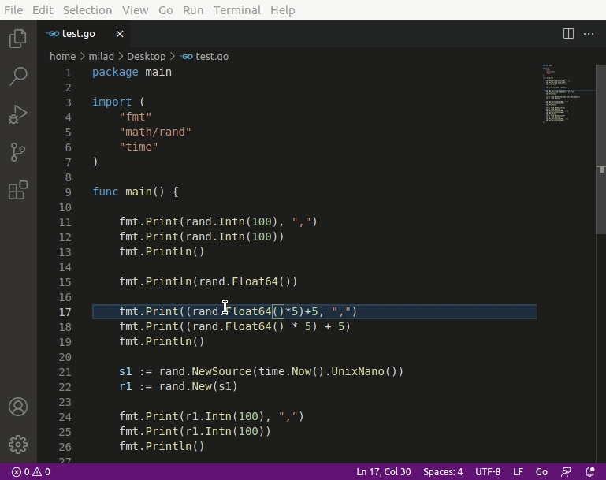
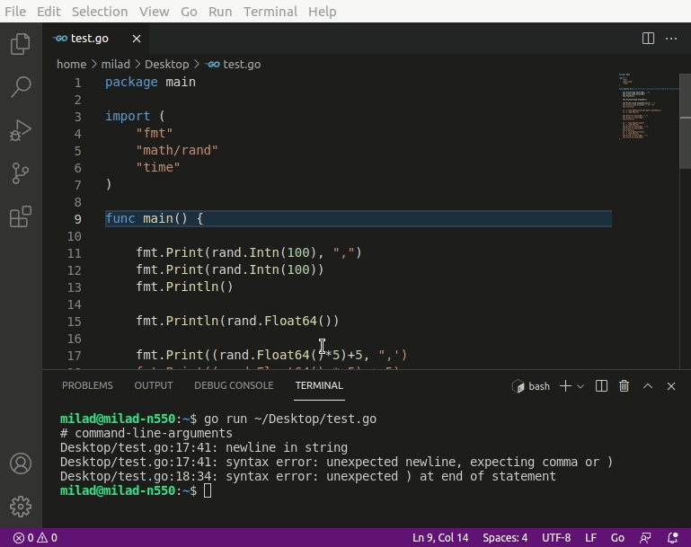

# Ecosia search

The Ecosia search extension for Visual Studio Code makes it easy to search your code on the internet. The extension uses Ecosia search engine, a search engine that plants trees! Code, search and help to plant trees. For more information, visit [Ecosia webpage](https://info.ecosia.org/what).

If you prefer **other search engines**, you still have the option to change the default search engine from the extension settings.

## What's new?

### [version 1.6.6]

- Add stackoverflow as an alternative search engine.

### [version 1.5.0]

- Add bing as an alternaive search engine.

### [version 1.4.x]

- Fixed problem with queries with special characters.
- Fixed setting changes do not take effect immediately.

### [version 1.3.0]

- Append language name to the query automatically.

### [version 1.2.0]

- Improved commands title.

### [version 1.x.x]

- Add option to select a different search engine.
- Now you can search for what you want just by using your keyboard shortcuts! Select or copy a text and use shortcuts to open the search results.

## Features

Highlight and right-click the text and select `Ecosia: Search`.

Search your clipboard text from vscode using `Ecosia: Search clipboard` command. This is especially helpful to search something from vscode terminal.

## Keybidings

Now you can easily search only by using keyboard shortcuts.

- `Ctrl+K Ctrl+Shift+F` to search from clipboard.
- `Ctrl+K Ctrl+Shift+S` to search the selected text.

You can change these settings using the vscode Keyboard shortcuts section.

## Extension Settings

This extension contributes the following settings:

- `ecosia-search.searchEngine`: Select your desired search engine (default is, of course, Ecosia)
- `ecosia-search.autoInsertLanguageName`: Whether to add language name to the query automatically (only for selected texts). Default is `true`.
- `ecosia-search.ifNoSelection`: Specifies the behavior in case no text is selected. Show errors by setting to `error` or opening an empty search result page using `emptySearchPage` (default).
- `ecosia-search.maxQueryLength`: Maximum search length (url length). Default is 2047 to support IE browser.

## Known Issues

- The context menu does not work on preview pages or terminal and I Can't search selected text.
  - At this moment, vscode does not support an API to use selected text in such windows. The workaround is to copy the text and use search from the clipboard or use the keyboard shortcuts to search the copied text.

Submit the issues if you find any bugs or have any suggestions.

## Disclaimer

This extension is not an official extension from Ecosia. The extension only opens search results inside the Ecosia search engine. [Ecosia](https://www.ecosia.org/) and all its assets are properties of [Ecosia GmbH](https://info.ecosia.org/about).
